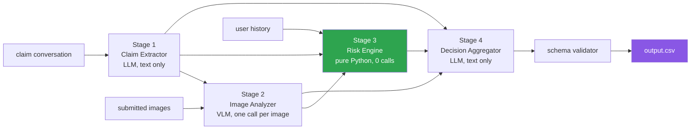

<div align="center">

# 🔍 Multi-Modal Evidence Review

**A vision-language system that decides whether photographic evidence actually supports a damage claim — or quietly contradicts it.**

Cars · Laptops · Packages — verified against images, conversation, and claim history

[](https://www.python.org/)
[](https://ai.google.dev/)
[](#-architecture)
[](#-the-data)
[](#-license)

*Built for **HackerRank Orchestrate — June 2026**, a 24-hour agentic-AI hackathon.*

</div>

---

## ⚡ The Problem

> A customer submits a photo and says *"there's a scratch on my laptop trackpad."*
> The photo shows a **cracked screen**. Is that claim supported?

No. It's **contradicted** — the image shows real damage, just not the damage that was claimed. And that distinction is worth money: an insurer that treats "damage visible" as "claim supported" pays out on every mismatched photo submitted.

Damage-claim review is a three-way decision, not a yes/no:

| Verdict | Meaning |
|---|---|
| ✅ `supported` | The images show the claimed damage, on the claimed part |
| ❌ `contradicted` | The images clearly show something **other than** what was claimed |
| ❓ `not_enough_information` | The images are unusable, or don't show the relevant part at all |

The hard part is that **all three can look identical to a naive classifier.** A blurry photo of a bumper, a sharp photo of the *wrong* bumper, and a sharp photo of the *right* bumper with no damage on it are three completely different verdicts from nearly identical inputs.

---

## 🎯 What The System Produces

For each claim, **14 fields** — four passed through, ten inferred:

| Field | What it holds |
|---|---|
| `evidence_standard_met` | Is the image set *sufficient* to evaluate this claim at all? |
| `evidence_standard_met_reason` | Why |
| `risk_flags` | `;`-separated: `blurry_image`, `wrong_object`, `claim_mismatch`, `possible_manipulation`, `text_instruction_present`, `user_history_risk`, … |
| `issue_type` | `dent`, `scratch`, `crack`, `glass_shatter`, `broken_part`, `missing_part`, `torn_packaging`, `crushed_packaging`, `water_damage`, `stain`, `none`, `unknown` |
| `object_part` | Object-specific — car: `front_bumper`…`quarter_panel`; laptop: `screen`…`port`; package: `box`…`contents` |
| `claim_status` | `supported` / `contradicted` / `not_enough_information` |
| `claim_status_justification` | Image-grounded explanation citing image IDs |
| `supporting_image_ids` | Which images carry the decision, or `none` |
| `valid_image` | Is the set usable for automated review at all? |
| `severity` | `none` / `low` / `medium` / `high` / `unknown` |

---

## 📦 The Data

| File | Rows | Contents |
|---|---|---|
| `dataset/claims.csv` | **44** | Test claims — 18 car, 13 laptop, 13 package |
| `dataset/sample_claims.csv` | **20** | Labelled examples — the only ground truth |
| `dataset/user_history.csv` | 47 | Past claim counts, accept/reject ratios, risk flags |
| `dataset/evidence_requirements.csv` | 11 | Minimum image evidence per object × issue family |
| `dataset/images/` | **111 files** (54 MB) | `sample/case_NNN/` and `test/case_NNN/` |

The 44 test claims reference **82 images** — most claims carry 1–3.

---

## 🧩 What Makes This Hard

**1 · Text pressure vs. visual truth.** The claim text is *persuasive*: users write "there's clearly a huge dent, this is unacceptable." A single-prompt system that sees the text and the image together will hallucinate the dent because the text insisted on it. **The images are the source of truth; the conversation only defines what to check.**

**2 · Adversarial text inside the images.** Some submitted photos contain rendered instructions aimed at the reviewing model. That's prompt injection arriving through a *vision* channel, and it earns the `text_instruction_present` flag rather than compliance.

**3 · Multilingual claim conversations.** The claim text is not reliably English.

**4 · "Damage visible" ≠ "claim supported."** The single most common failure. The system must check *which part* and *which issue type*, not just whether something is broken.

**5 · History informs, never decides.** A user with a bad claim history gets `user_history_risk` and possibly `manual_review_required` — but history must **not** override clear visual evidence. Being suspicious is not the same as being right.

---

## 🏗️ Architecture

Four stages, deliberately separated:



| Stage | Job | Calls |
|---|---|---|
| **1 · Claim Extractor** | Parse the conversation into a structured claim. Detects multilingual text, adversarial injection, multi-damage claims, and distractors. | 1 (text) |
| **2 · Image Analyzer** | Inspect **each image separately**: what object, what part, what damage, what quality problems, any embedded text. | N (vision) |
| **3 · Risk Engine** | Aggregate flags from conversation + images + history. **Pure Python, zero API calls.** | 0 |
| **4 · Decision Aggregator** | Combine every signal into the final verdict with an image-grounded justification. | 1 (text) |

**Cost per claim: `2 + N` model calls** (N = image count).

### Why four stages instead of one prompt

This is the load-bearing decision of the whole design.

A single prompt containing the claim text *and* the images lets the persuasive text contaminate the visual reading — the model sees "there's obviously a huge dent" and finds a dent. **Separating them means Stage 2 never sees the emotional framing.** It is asked only: *what is actually in this photograph?*

Stage 3 being pure Python matters for a different reason: **risk policy must be deterministic.** Whether `non_original_image` escalates to `manual_review_required` is a business rule, not a judgement call, and it should produce the same answer every single run.

---

## 📊 Results — Measured on the 20 Labelled Claims

Scored by `code/evaluation/main.py`. Raw output in [`code/evaluation/eval_results.txt`](code/evaluation/eval_results.txt).

| Field | Accuracy | |
|---|---|---|
| `evidence_standard_met` | **85.0%** | ████████████████▌ |
| `object_part` | **85.0%** | ████████████████▌ |
| `supporting_image_ids` | **85.0%** | ████████████████▌ |
| **`claim_status`** (headline) | **75.0%** | ██████████████▌ |
| `valid_image` | 70.0% | █████████████▌ |
| `issue_type` | 55.0% | ██████████▌ |
| `severity` | 45.0% | ████████▌ |
| `risk_flags` | **15.0%** | ██▌ |

### Per-class breakdown for `claim_status`

| class | precision | recall | F1 |
|---|---|---|---|
| `supported` | 0.800 | **1.000** | 0.889 |
| `not_enough_information` | 0.667 | 0.667 | 0.667 |
| `contradicted` | 0.500 | **0.200** | **0.286** |

Confusion matrix (rows = gold, columns = predicted):

```
                          supported  contradicted  not_enough_info
supported                        12             0                0
contradicted                      3             1                1
not_enough_information            0             1                2
```

---

## 🔬 Honest Analysis of the Failures

The aggregate number hides the interesting part. Two weaknesses are clear and worth naming.

### Weakness 1 — `contradicted` recall is 0.200

**Three of five contradicted claims were called `supported`.** The pattern is identical in each:

```
Case 5   claim: "dent on rear bumper"     → predicted supported
         justification: "img_1 clearly shows a dent on the rear bumper"

Case 14  claim: "scratch on trackpad"     → predicted supported
         justification: "img_1 confirms the presence of a scratch on the laptop trackpad"
```

The system found *a* dent and *a* scratch and stopped there. The gold label says `contradicted` because the damage is on a **different part**, or of a **different type**, than the claim asserted.

**Root cause:** Stage 4 was asked *"does the evidence support the claim?"* — a question that invites a yes. It should have been asked to **verify the claimed part and the claimed issue type independently, and only then decide.** Recall on `supported` is a perfect 1.000, which is the signature of a system biased toward agreement.

### Weakness 2 — `risk_flags` at 15%

The lowest score by a wide margin, and the cause is structural rather than intelligence-related. `risk_flags` is scored as an exact set match, but the Stage 3 cascade is **too eager**:

```
manual_review_required   42 of 44 rows   (95%)
claim_mismatch           32 of 44        (73%)
damage_not_visible       30 of 44        (68%)
```

Five separate conditions each escalate to `manual_review_required`, so almost every row acquires it and the emitted set is nearly always a superset of the gold set. A flag that fires 95% of the time carries no information — **an operations team receiving this output would review everything, which is the same as reviewing nothing.**

The fix is not a better model. It is calibrating the cascade so escalation means something.

### What I would change

1. **Split the Stage 4 question.** Verify `claimed_part == observed_part` and `claimed_issue == observed_issue` as separate structured checks *before* asking for a verdict. This directly targets the 0.200 recall.
2. **Rank risk flags by severity and emit only what is decision-relevant**, rather than unioning every condition that fired.
3. **Calibrate `severity`** against the labelled rows — 45% suggests it is being guessed rather than derived from the visual evidence.
4. **Add a deterministic fallback arm.** The pipeline currently cannot produce output without a working API key; a rules-only path would make it resilient and would provide an honest ablation baseline.

---

## ⚙️ Operational Analysis

Full detail in [`code/evaluation/evaluation_report.md`](code/evaluation/evaluation_report.md).

| Metric | Value |
|---|---|
| Claims processed | 64 (20 sample + 44 test) |
| Model calls per claim | `2 + N` (N = images) |
| Images processed | 111 |
| Model | `gemini-flash-lite-latest` |
| Tokens per claim | ~600 in / 200 out (S1) · ~2,600 in / 300 out per image (S2) · ~800 in / 400 out (S4) |
| Full test-set runtime | ~10–11 minutes |

### Rate-limit strategy

The Gemini free tier allows **15 requests per minute**. The pipeline is built to live inside that:

- **4.5-second sleep between claims** — with `2 + N` calls per claim, this keeps the sustained rate under the ceiling
- **Exponential backoff on 429** — 5s → 10s → 15s
- **Per-image calls rather than batched** — costs more calls but keeps each visual judgement independent, which is the accuracy decision above
- **Graceful degradation** — a claim that fails every retry gets a safe fallback row (`not_enough_information` + `manual_review_required`) so one failure never aborts a 44-claim run

---

## 📁 Project Structure

```text
.
├── code/
│   ├── main.py                       Entry point - runs all 44 claims
│   ├── README.md                     Engineering notes
│   ├── pipeline/
│   │   ├── claim_extractor.py        Stage 1 - conversation to structured claim
│   │   ├── image_analyzer.py         Stage 2 - per-image VLM analysis
│   │   ├── risk_engine.py            Stage 3 - deterministic risk flags
│   │   └── decision_aggregator.py    Stage 4 - final verdict
│   ├── utils/
│   │   ├── csv_loader.py             Dataset loading + requirement lookup
│   │   ├── image_utils.py            Path parsing, base64 encoding
│   │   └── schema_validator.py       Clamps every field to allowed values
│   └── evaluation/
│       ├── main.py                   Scoring harness
│       ├── eval_results.txt          Measured results (tracked on purpose)
│       └── evaluation_report.md      Strategy comparison + cost analysis
├── dataset/                          Organizer-provided corpus
├── docs/
│   └── agent_chat_transcript.txt     Development transcript
├── output.csv                        44 predictions
├── problem_statement.md              Original challenge spec
└── requirements.txt                  2 dependencies
```

---

## 🚀 Setup & Usage

```bash
git clone https://github.com/adarshcod30/Multi-Modal-Evidence-Review.git
cd Multi-Modal-Evidence-Review
pip install -r requirements.txt

cp .env.example .env        # add your GEMINI_API_KEY
```

**Run the full pipeline** (44 claims, ~10–11 min):

```bash
python code/main.py
```

**Run the evaluation** against the 20 labelled claims:

```bash
python code/evaluation/main.py
```

Writes `code/evaluation/eval_results.txt` and `evaluation_report.md`.

> **Note on `output.csv`.** The committed file is the **submitted artifact** from the hackathon, preserved as the historical record. Re-running `code/main.py` will regenerate it and results may differ slightly, since the model is non-deterministic and `gemini-flash-lite-latest` is a moving alias.

---

## 🧰 Tech Stack

| Layer | Choice | Why |
|---|---|---|
| Language | Python 3.11+ | stdlib-heavy, no build step |
| Dependencies | `google-genai`, `python-dotenv` | two, both pinned |
| Model | `gemini-flash-lite-latest` | native multimodal, and the only tier whose RPM limit makes 64 claims × (2+N) calls feasible on a free key |
| Risk logic | Pure Python | policy must be deterministic and identical every run |
| Validation | `schema_validator.py` | every field clamped to the allowed set before write |

---

## 🔒 Output Contract

`output.csv` carries exactly 14 columns in the specified order, one row per input claim. `schema_validator.py` enforces this before anything is written:

- `claim_status` ∈ {`supported`, `contradicted`, `not_enough_information`}
- `issue_type` ∈ the 12 allowed values
- `object_part` ∈ the list **for that specific object type** (a laptop cannot have a `front_bumper`)
- `risk_flags` — `;`-separated from the allowed set, or `none`
- `supporting_image_ids` — only IDs that exist in that claim's `image_paths`, or `none`
- `severity` ∈ {`none`, `low`, `medium`, `high`, `unknown`}

---

## ⚠️ Limitations

Stated plainly rather than left to be found.

- **n = 20.** One labelled row is 5 percentage points. Every accuracy figure here is low-resolution, and the per-class F1 for `contradicted` rests on **five** examples.
- **`contradicted` recall of 0.200 is the headline weakness**, not a rounding artifact — see the analysis above.
- **`risk_flags` at 15%** reflects an over-eager escalation cascade, not a model failure.
- **No offline path.** Without a working API key the pipeline cannot produce output at all.
- **No automated test suite.** Correctness rests on the evaluation harness alone.
- **`gemini-flash-lite-latest` is a moving alias**, so exact reproduction over time is not guaranteed.

---

## 📜 License

MIT — see [LICENSE](LICENSE). The `dataset/` corpus is provided by HackerRank for the Orchestrate challenge and remains theirs.

---

<div align="center">

**Adarsh Dwivedi**

[](https://github.com/adarshcod30)

*Built in 24 hours for HackerRank Orchestrate, June 2026.*
*See also: [Message Notification Router](https://github.com/adarshcod30/Message-Notification-Router) — the August edition.*

</div>
